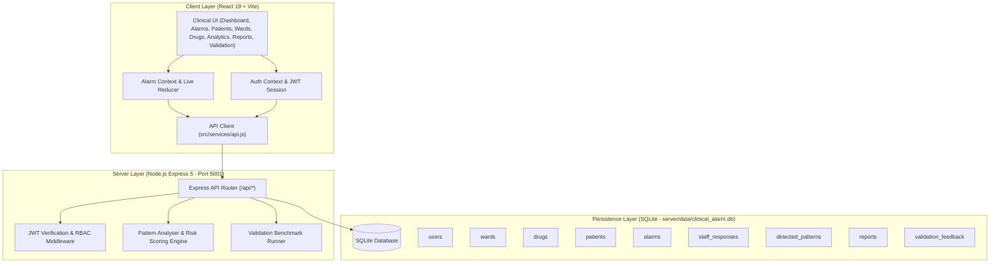

# Intelligent Clinical Medication Alarm Monitoring and Pattern Analysis System

[](https://nodejs.org/)
[](https://react.dev/)
[](https://vite.dev/)
[-orange.svg)](https://nodejs.org/api/sqlite.html)
[-teal.svg)]()

A full-stack, hospital-grade clinical decision support and pattern analysis application designed to mitigate clinical alarm fatigue, detect multi-feature medication alert patterns, monitor ward risk escalations, and provide explainable evidence for clinical interventions.

---

## 1. Project Objective

Hospital inpatient wards and ICUs experience thousands of clinical monitor and infusion alerts every shift, of which 72%–95% are non-actionable nuisance alarms. This causes severe **alarm fatigue**, missed critical medication doses, and delayed clinical intervention.

The objective of this system is to:
1. Aggregate and continuously evaluate medication alarms across inpatient wards.
2. Ingest patient contextual data (diagnoses, renal/hepatic biomarkers, prescribed high-risk medicines).
3. Detect complex, multi-feature alarm patterns beyond simple single-threshold alerts (repeated missed doses, overdue clusters, rapid escalation storms, duplicate orders).
4. Provide explainable clinical reasoning (risk scores, confidence, uncertainty, and evidence links).
5. Persist staff acknowledgements, resolutions, patient admissions, medication registries, and evaluation metrics in an ACID-compliant SQLite database.

---

## 2. Technology Stack

- **Frontend**:
  - React 19 (Hooks, Context + Reducer state management)
  - Vite 8 (Modern ES build system with `/api` proxy)
  - Pure Vanilla CSS (Hospital-grade clinical dark theme, responsive grid layouts, micro-animations)
- **Backend**:
  - Node.js v24 LTS with Express 5 REST API
  - Built-in `node:sqlite` (`DatabaseSync`) for persistent zero-dependency storage
  - Built-in `node:crypto` (HMAC-SHA256 JWT tokens & scrypt password hashing)
  - `dotenv` for environment configuration
- **Architecture**:
  - Decoupled RESTful API on port `5001`
  - Client on port `5173` (proxied in dev; served statically via `dist/` in production)

---

## 3. System Architecture



---

## 4. Database Schema & Tables

The database is automatically initialized and seeded in `server/data/clinical_alarm.db`:

| Table | Purpose | Key Attributes |
|---|---|---|
| `users` | Clinical staff credentials and roles | `id`, `name`, `email`, `password_hash`, `password_salt`, `role`, `created_at` |
| `wards` | Hospital inpatient ward configurations | `id`, `name`, `short_name`, `beds`, `specialty`, `created_at` |
| `drugs` | High-risk medication registry | `id`, `name`, `dose`, `category`, `risk_level`, `risk_score`, `monitor_param`, `notes` |
| `patients` | Admitted inpatient records | `id`, `display_name`, `ward_id`, `bed`, `age`, `conditions`, `medications`, `base_risk_score` |
| `alarms` | Recorded medication alarms | `id`, `patient_id`, `ward_id`, `drug_id`, `type`, `severity`, `label`, `status`, `timestamp` |
| `staff_responses` | Clinical staff audit trail | `id`, `alarm_id`, `user_id`, `user_name`, `action_type`, `notes`, `response_time_ms` |
| `detected_patterns`| Real-time multi-feature pattern alerts | `id`, `type`, `severity`, `title`, `message`, `evidence`, `risk_score`, `confidence`, `uncertainty` |
| `reports` | Generated experiment & audit reports | `id`, `title`, `generated_by`, `total_alarms`, `patterns_detected`, `data_json` |
| `validation_feedback`| Stakeholder reviews & evaluations | `id`, `role`, `rating`, `comment`, `label`, `created_at` |

---

## 5. Clinical Pattern Detection Engine

The system analyses the alarm stream against 6 clinical rule models:

1. **`REPEATED_MISSED_DOSE`** (`critical`, `ESCALATION`):
   - Trigger: Same patient + same drug with $\ge 2$ missed dose alarms within a 4-hour window.
2. **`WARD_OVERDUE_CLUSTER`** (`high`, `NUISANCE`):
   - Trigger: $\ge 3$ overdue medication alarms from the same ward within 1 hour.
3. **`RAPID_ESCALATION`** (`critical`/`high`, `ESCALATION`):
   - Trigger: Patient triggering $\ge 3$ active alarms within 2 hours.
4. **`DUPLICATE_ALERT`** (`high`, `NUISANCE`):
   - Trigger: Same patient + same drug with $\ge 2$ alarms within 20 minutes (possible dispensing/system glitch).
5. **`HIGH_RISK_DRUG_STORM`** (`critical`, `ESCALATION`):
   - Trigger: A ward experiencing $\ge 2$ simultaneous critical-severity active alarms.
6. **`FREQUENCY_BASELINE`** (`high`/`low`, `NUISANCE`):
   - Comparative benchmark model evaluating simple frequency count per hour.

---

## 6. Authentication & User Roles

- Cryptographically secure password hashing using Node `scrypt` (64-byte derived keys with unique 16-byte random salts and `timingSafeEqual` comparison).
- Stateless RFC 7519 HMAC-SHA256 JWT tokens.
- Default seeded clinician accounts:
  - **Dr. R. Ahmed** (`ahmed@hospital.nhs.uk`, pass: `doctor123`) — *Senior Pharmacist*
  - **Dr. Sarah Lin** (`sarah.lin@hospital.nhs.uk`, pass: `doctor123`) — *Ward Doctor*
  - **Nurse J. Taylor** (`taylor@hospital.nhs.uk`, pass: `nurse123`) — *Staff Nurse*
- Quick role-switching available via the Clinician Portal modal for demonstration convenience.

---

## 7. How to Run Locally

### Prerequisites
- Node.js v24.x LTS
- npm v11.x

### Setup & Launch
1. Clone or navigate to the project directory:
   ```bash
   cd "c:\Users\ADMIN\Documents\COE PROJECT"
   ```

2. Verify environment configuration:
   ```bash
   cp .env.example .env
   ```

3. Run the automated backend integration test suite (18 automated tests):
   ```bash
   npm run test:api
   ```

4. Start the backend API server:
   ```bash
   npm run server
   # Listening at http://localhost:5001
   ```

5. In another terminal, start the Vite development server:
   ```bash
   npm run dev
   # Accessible at http://localhost:5173
   ```

6. Alternatively, build and serve the production bundle:
   ```bash
   npm run build
   npm start
   # Server on http://localhost:5001 serves both the API and frontend
   ```

---

## 8. Environment Variables

Create a `.env` file in the root directory (based on `.env.example`):

```env
PORT=5001
JWT_SECRET=super_secret_clinical_alarm_key_2026
DB_PATH=./server/data/clinical_alarm.db
NODE_ENV=development
```

---

## 9. Verification & Automated Testing

The project includes an automated test runner (`server/test_api.js`) verifying:
- `/api/health` system and database health
- User authentication, password hashing, and JWT validation
- Clinician user registration
- Alarm retrieval, manual creation, acknowledgement, and resolution
- Automatic trigger and persistence of detected patterns
- Patient admission and ward assignment
- Ward retrieval and live risk scoring
- Drug registry listing and medication registration
- Analytics KPI aggregation and nuisance rate calculation
- Automated benchmark validation suite (TP, FP, FN, TN, precision, recall, F1)
- Stakeholder feedback submission and retrieval
- Clinical report persistence in SQLite

Run tests anytime with:
```bash
npm run test:api
```

---

## 10. Project Phase Status

### Phase 2 Accomplishments (Current ~70% Completion):
- [x] Full-stack architecture with Express REST API and persistent SQLite database.
- [x] User authentication (Registration, Login, JWT session tokens, scrypt password hashing).
- [x] Persistent alarm management (Creation, Acknowledgement, Resolution, Staff audit log).
- [x] Server-side pattern detection engine automatically calculating multi-feature patterns.
- [x] Interactive modals: Dispatch Alarm, Admit Patient, Register Medication, Add Ward.
- [x] Real-time analytics aggregating actual database KPIs, nuisance rates, and response times.
- [x] Persistent clinical report saving and history modal.
- [x] Persistent stakeholder validation reviews and benchmark test suite.
- [x] Production build tested and verified with 0 errors.

### Phase 3 Roadmap (Remaining ~30% for Final Release):
- [ ] WebSocket / Server-Sent Events (SSE) for zero-latency multi-client synchronisation.
- [ ] Direct integration with Hospital EHR standards (HL7 / FHIR protocol connectors).
- [ ] Real-time bedside vital signs telemetry ingestion (ECG, SpO2, arterial pressure streams).
- [ ] Advanced role-based fine-grained permissions (Pharmacist-only drug approval workflows).
- [ ] Automated daily database backups and encrypted archive export.
